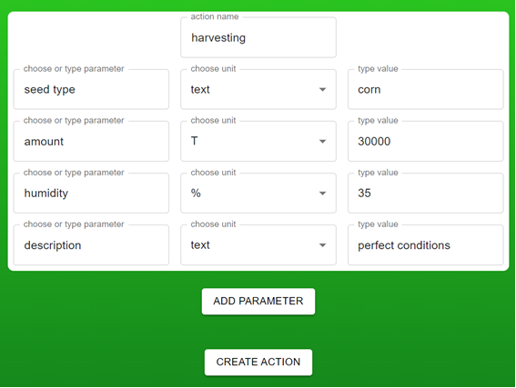

# Farm management system
##Disclaimer - This is my project. It is unfinished yet.
###Farm Management System is a system designed to help farmers manage their farm workflow.

##Description
Main purpose of the application is to make it as easy to use as possible for farmers, so the app will be handy for them and easy to use for older people too.
Farmers usually take a lot of notes about things they do or use - with this application farmers can make notes about the actions, tasks that must be performed. Farmers can just simply provide parameters to this app instead of providing it to their notebooks  "you can easily forget the notebook but it is less likely that you will forget you phone". Moreover when other users are connected to the same Farm they can see each others work.

### It is important to mention that the screenshots below are from very first version of this app that just served as my diploma thesis. This particular app lacks error handling and many other things that I intend to implement with this project.

